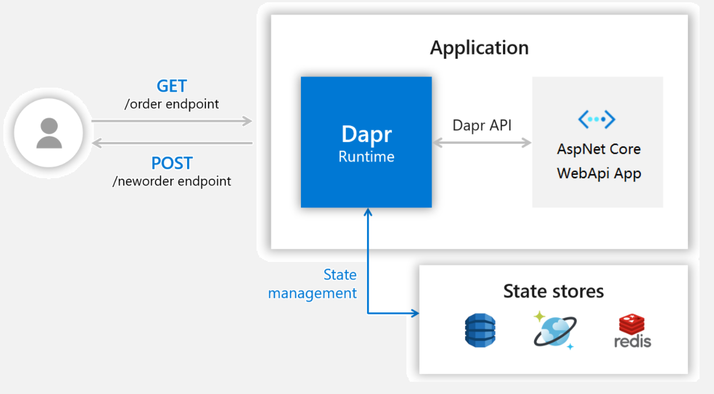
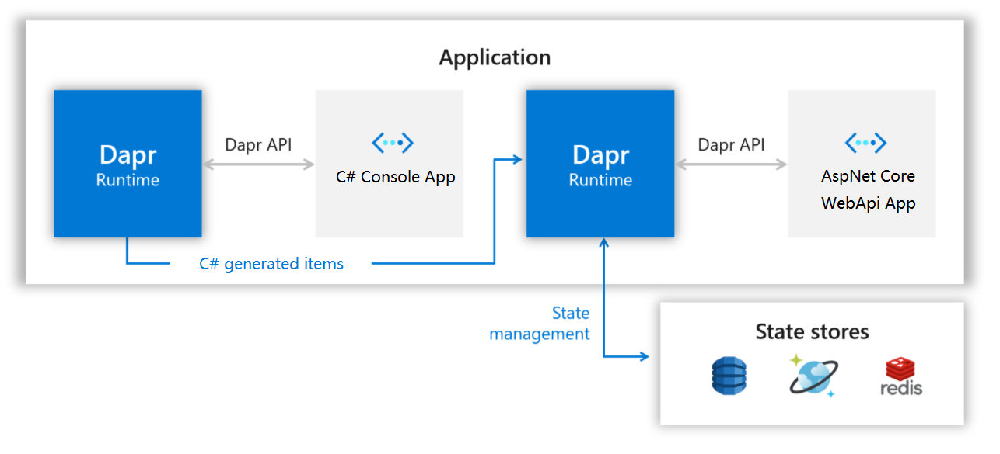

# Hello World

本教程将演示如何在您的机器上本地运行Dapr。您将部署一个ASP.NET Core应用程序，订阅订单信息并持久化它们。
下面的架构图说明了组成第一部分示例的组件:



之后，将部署一个C#控制台应用程序作为发布者。下面的架构图显示了新组件的添加::



## 必备条件
这个快速入门需要在您的机器上安装以下程序：
- [Docker](https://docs.docker.com/)
- [Dapr](https://docs.dapr.io/getting-started/install-dapr/)
- [Postman](https://www.getpostman.com/) [Optional]

## 

### 运行orderservice 
切换到 `hello-world/HelloWorld.OrderService` 目录下执行以下命令
```sh
dapr run --dapr-http-port 3500 --app-id orderservice --app-port 3600  dotnet run
```

### 运行订单创建程序
切换到 `hello-world/HelloWorld.Console` 目录下执行以下命令
```sh
dapr run --app-id ordercreater dotnet run
```

